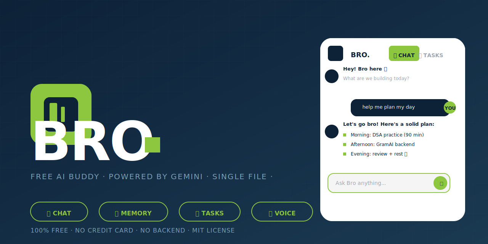

# 🤖 Bro — Free AI Buddy

> A smart, single-file AI chat app. Works **online** with Google Gemini and **offline** with a real AI model running directly in your browser. No server. No backend. No subscription. Ever.



---

## ✨ What is Bro?

**Bro** is a 100% free, single-file AI chat application. It supports two AI engines:

- **Online mode** — uses Google Gemini API (free tier, no credit card)
- **Offline mode** — runs a real AI model inside your browser using Transformers.js / WebLLM. No internet needed after first download.

Everything is stored locally — your chat history, memory, and tasks never leave your device.

---

## 🚀 Live Demo

Open `index.html` in Chrome. That's it.

**Or host it for free:**

| Platform | How |
|---|---|
| GitHub Pages | Push repo → Settings → Pages → Source: GitHub Actions |
| Netlify Drop | Drag folder to [netlify.com/drop](https://app.netlify.com/drop) |
| Vercel | `vercel --prod` in this folder |

---

## 🎯 Features

| Feature | Details |
|---|---|
| 💬 **AI Chat** | Gemini online OR local model offline |
| 📴 **Offline AI** | Real AI in browser — 3 model options |
| 🧠 **Memory** | Bro learns from chats and remembers you |
| ✅ **Tasks** | Priority-sorted to-do list with due dates |
| 🎤 **Voice Input** | Speak your messages (Chrome) |
| 🔊 **Text-to-Speech** | Bro reads replies aloud |
| 🌍 **Multilingual Voice** | Hindi, Tamil, Telugu, Marathi, Bengali + more |
| 🔒 **Private** | All data stays in your browser |
| 📱 **Mobile Ready** | Fully responsive |

---

## 🧠 Offline AI Models

Choose your offline model in ⚙️ Settings:

| Model | Size | Device | Quality | Best for |
|---|---|---|---|---|
| 🟢 SmolLM2 360M | ~220MB | WASM (any browser) | Basic | Quick facts, simple chat |
| 🟡 Qwen2.5 0.5B | ~400MB | WebGPU (Chrome+GPU) | Good | Reasoning, longer answers |
| 🔴 Phi-3 Mini | ~2.4GB | WebLLM (Chrome+GPU) | Excellent | Near GPT-3.5 quality |

> **First time only:** models download and cache in your browser. After that, they work forever with zero internet.

---

## 🔑 Getting Your Free Gemini API Key

1. Go to [aistudio.google.com/app/apikey](https://aistudio.google.com/app/apikey)
2. Sign in with Google
3. Click **"Create API key"** → copy it
4. Open Bro → ⚙️ Settings → paste the key

**Free limits:** Gemini Flash: 250 req/day · Flash-Lite: 1,000/day · Pro: 100/day

---

## 📁 File Structure

```
bro/
├── index.html              ← The entire app (self-contained, ~66KB)
├── README.md               ← This file
├── LICENSE                 ← MIT License
├── CHANGELOG.md            ← Version history
├── CONTRIBUTING.md         ← How to contribute
├── .gitignore              ← Standard web gitignore
└── assets/
    └── banner.svg          ← GitHub social preview image
└── .github/
    ├── workflows/
    │   └── deploy.yml      ← Auto-deploy to GitHub Pages
    └── ISSUE_TEMPLATE/
        ├── bug_report.md
        └── feature_request.md
```

---

## 🛠️ Tech Stack

| Layer | Tech |
|---|---|
| Frontend | Vanilla HTML, CSS, JavaScript (ES Modules) |
| Online AI | Google Gemini API (REST) |
| Offline AI (WASM) | [@huggingface/transformers](https://github.com/huggingface/transformers.js) v3.8 |
| Offline AI (GPU) | [@mlc-ai/web-llm](https://github.com/mlc-ai/web-llm) |
| Storage | Browser localStorage |
| Fonts | Barlow Condensed + Barlow (Google Fonts) |
| Voice | Web Speech API |

Zero dependencies to install. Zero build step. Zero backend.

---

## 🎨 Design System

Inspired by clean corporate design systems — white background, deep navy `#0d2137`, lime green `#8dc63f`.

- **Font:** Barlow Condensed 900 (headers) + Barlow 400/600 (body)
- **Layout:** Floating pill navbar · accordion rows · pill CTAs
- **Mode badge:** Live indicator showing Online/Offline AI status

---

## 🧠 How Memory Works

Bro automatically extracts facts from your chats using a secondary Gemini call:

```
You: "I'm studying DSA for my IGDTUW exams next week"
→ Bro saves: { college: "IGDTUW", study_subject: "DSA" }
```

These facts inject silently into every future conversation. View, edit or delete them in the 🧠 Memory tab.

---

## ⚙️ localStorage Keys

| Key | Contents |
|---|---|
| `bro_gkey` | Gemini API key |
| `bro_msgs` | Chat history (last 120 messages) |
| `bro_mem` | Memory key-value store |
| `bro_tasks` | Task list |
| `bro_cfg` | Settings (model, language, AI mode) |

---


## 📜 License

MIT — do whatever you want with it.

---

<p align="center">
  Made with ☕ · Single file · Zero backend · Forever free
  <br><br>
  <strong>⭐ Star this repo if Bro helped you!</strong>
</p>
